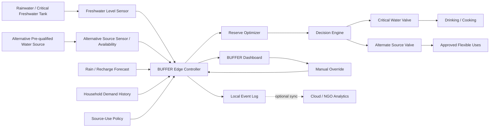
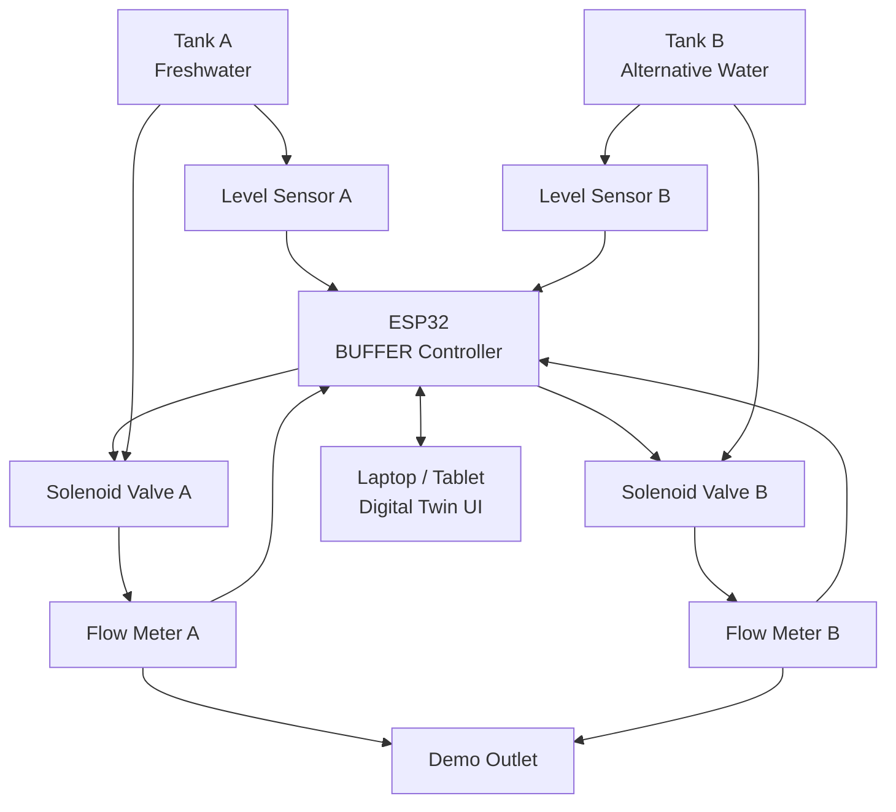
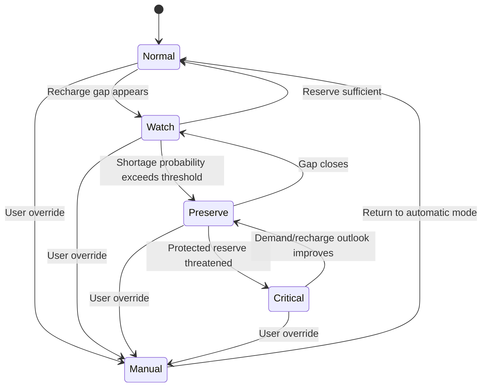

# BUFFER
## Adaptive Freshwater Reserve Management for Climate-Vulnerable Households

> **Project status (9 October 2026):** Software, simulation and firmware built and tested; physical prototype not built; stakeholder conversations scheduled; submission materials in progress  
> **Competition:** Xylem Global Student Innovation Challenge 2026  
> **Track:** University  
> **Challenge:** **Water Access — Enabling universal access to reliable, affordable WASH services**  
> **Primary goal:** Build a Grand Prize-caliber submission that is scientifically grounded, visually demonstrable, feasible to implement, and clearly differentiated from generic “IoT water monitoring” projects.

---

# Build status

This brief was written before anything was built. This section records what now exists, so every
claim in the submission can be traced to a file. Evidence labels follow §88.

## Built and tested

| Tier (§19) | What exists | Where | Evidence |
|---|---|---|---|
| Tier 1-4: model, policy, hedging, uncertainty | Daily water balance on **real rainfall** (NASA POWER, Koyra, 1991-2025, 34 dry seasons); BUFFER rule (§42) against three baselines (§50); tank, household, forecast and dry-pond sweeps; 2,000-run Monte Carlo; advice-compliance and sensor-outage runs | `simulation/` | 10 tests passing; `results/REPORT.md` |
| Tier 5: controller | ESP32 firmware: two ultrasonic level sensors, two flow sensors, two valves via relays, metered requests, daily flexible allowance, household override, sensor-fault fail-safe, USB telemetry | `firmware/` | 12 native tests passing; compiles for ESP32 (RAM 6.8%, flash 23.1%) |
| Tier 6: digital twin | 3D dashboard with a guided demo, an Explore mode running the model live, and a Live device mode that mirrors the controller over USB | `dashboard/` | Builds; scripted browser checks |
| Tier 7: validation plan | 12 bench tests with pass criteria | `validation/experiments.md` | Not yet run |
| Tier 8: feasibility | Priced bill of materials, wiring, serial protocol, household retrofit plan, failure modes, deployment and business model, field pilot plan | `hardware/`, `docs/` | Documents |
| Research | Bibliography, prior-art comparison, assumptions register | `research/` | Documents |

## Key results (SIMULATED, real rainfall, assumed household)

5 people, 3,000 L tank, 20 L/day drinking and cooking, 30 L/day flexible use:

| | Without BUFFER | With BUFFER |
|---|---|---|
| Shortage days per dry season | 70.5 | 0.5 |
| Seasons with any shortage (of 34) | 34 | 3 |
| Chance of a shortage, 2,000 resampled seasons | 99.9% | 8.2% |

- Same protection as always using the alternative source, with 54% less alternative water.
- Holds when the pond dries March-May (0.5 days against 9.0 for a static rule).
- Small tanks (1,000-2,000 L) still fall short: BUFFER cannot create water.
- Advice-only mode loses most of the benefit unless followed nearly every day (80% compliance: 8.1 days), which is why automatic valves matter.

## Not done yet

| Item | Plan |
|---|---|
| Physical prototype | Not built (about 5,800 BDT, `hardware/bom.csv`). Prototype footage in the video is an AI-generated visualisation of the planned setup and is disclosed as such in the submission |
| Stakeholder conversations | Three 15-minute conversations: a WASH researcher, an NGO field officer, a coastal household. Notes go in `research/stakeholder-notes.md` |
| Field pilot | Planned (`docs/PILOT_PLAN.md`); after the competition |
| Patent search | Before any "first" or "only" claim (§87) |

## Changes from the original plan

- **Demo numbers.** The original demo scenario (120 L, recharge on day 7 then 9) was not achievable even
  with drinking water alone. The demo now uses 200 L: conventional use runs dry on day 4.0; BUFFER holds to
  day 7.0, then 9.0 after the rain is delayed.
- **The demo script in §27** uses illustrative 24/31/34-day numbers; the submission uses the simulated
  results above instead.
- **No machine learning** (§39): the transparent allocation rule performs as well as an oracle that knows
  the true recharge date, so no model is trained.

---

# 0. One-Sentence Definition

**BUFFER is a household freshwater-reserve controller that predicts when scarce high-quality water will run out, protects a minimum drinking-and-cooking reserve, and intelligently shifts non-critical water demand to other suitable sources so families can make freshwater last until the next reliable recharge.**

---

# 1. The Core Idea

Many water-insecure households do not live in a simple world of “water” versus “no water.”

They often have **multiple water sources with different quality, reliability, cost, seasonality, and intended use**.

A coastal household may have:

- stored rainwater,
- saline or brackish groundwater,
- pond water,
- purchased water,
- community-supplied water,
- another seasonal source.

The scarce resource is often not water in general.

The scarce resource is **fresh, suitable water for critical uses such as drinking and cooking**.

BUFFER treats this critical freshwater reserve the way a battery-management system treats stored electricity:

- measure the remaining reserve,
- estimate future demand,
- estimate the time until recharge,
- preserve a minimum safety reserve,
- ration before a crisis occurs,
- shift replaceable demand away from the critical reserve,
- continuously update the plan as conditions change.

The user should be able to look at BUFFER and immediately understand:

> **“I have 31 days of freshwater left, but reliable rain is 37 days away. BUFFER needs to preserve six additional days of drinking water.”**

This is the product.

---

# 2. Why the Name “BUFFER”

**BUFFER** is intentionally simple.

It has several layers of meaning:

1. A **water buffer** protects a household against uncertainty between rainfall/recharge events.
2. In computing, a buffer temporarily stores a valuable resource so demand spikes do not cause failure.
3. In engineering, a buffer absorbs variability and prevents systems from crossing critical limits.
4. BUFFER’s job is literally to maintain a **freshwater safety buffer**.

The word is familiar, memorable, serious, and compatible with both a physical controller and a software platform.

### Suggested tagline

**Protect the water you cannot replace.**

Alternative:

**Make freshwater last until the next rain.**

Technical descriptor:

**Adaptive Freshwater Reserve Management**

---

# 3. Problem Statement

## 3.1 Global problem

Water access is not only about whether a household has a water source.

It is also about:

- whether that source remains available through dry periods,
- whether the household can afford alternative water,
- whether different available sources are suitable for different uses,
- whether a limited high-quality reserve is used efficiently,
- whether the household knows early enough that it is heading toward a shortage.

Xylem’s 2026 Water Access challenge explicitly emphasizes:

- reliability,
- equity,
- resilience,
- affordability,
- decentralized water systems,
- infrastructure monitoring,
- sustainable supply,
- underserved and water-insecure communities,
- reducing the burden of water access.

BUFFER should therefore be entered under **Water Access**, not Water Quantity.

Water Quantity is defensible, but Water Access gives the stronger human-impact story.

---

# 4. Target Problem: Coastal Bangladesh

Southwestern coastal Bangladesh is a particularly strong initial deployment context because households face:

- salinity intrusion into surface and groundwater,
- seasonal rainfall,
- dependence on stored rainwater,
- limited freshwater storage,
- expensive or difficult alternatives,
- climate-related uncertainty.

Research in coastal Bangladesh has repeatedly found that rainwater harvesting is widely used but often does not provide reliable year-round supply.

A 2025 study in salinity-affected Koyra reported:

- **100% of surveyed households used rainwater during the monsoon**
- only **27% maintained year-round access**
- inadequate storage and water-quality concerns were major limitations.

A 2022 household rainwater-harvesting study in Khulna and Satkhira reported that stored rainwater commonly lasts only part of the year, and households deliberately conserve rainwater for the hottest dry-season period.

This is the gap BUFFER addresses:

> **Rainwater harvesting creates a freshwater reserve. BUFFER manages that reserve so it survives as long as possible.**

---

# 5. Research Insight Behind BUFFER

## 5.1 Households already ration water by quality and use

The concept is not based on imaginary behavior.

Research on **multiple water source use (MWSU)** shows that households in low- and middle-income countries commonly use different water sources for different purposes and may switch sources seasonally.

Examples include:

- higher-quality water reserved for drinking/cooking,
- lower-quality or closer sources used for washing,
- rainwater used heavily during wet periods,
- stored rainwater rationed during dry periods.

A systematic review found multiple-source use across many LMIC settings and concluded that focusing only on a household’s “main” drinking source misses important water-security behavior.

BUFFER does not ask households to adopt an alien behavior.

It **formalizes and optimizes behavior households already perform manually**.

---

# 6. The Research Translation

BUFFER combines three established bodies of knowledge in a new household-level operating objective:

## 6.1 Rainwater water-balance modeling

Rainwater-harvesting researchers already model:

- roof catchment,
- rainfall,
- tank storage,
- demand,
- overflow,
- reliability.

BUFFER uses the same water-balance logic continuously after installation.

## 6.2 Multiple Water Source Use

Research shows households often choose different sources for different uses.

BUFFER explicitly models the household as a **portfolio of water sources**, not a single source.

## 6.3 Reservoir hedging theory

In reservoir engineering, **hedging** means reducing present releases before a reservoir becomes empty in order to reduce the risk of severe shortage later.

BUFFER brings this principle down from utility-scale reservoirs to a household freshwater tank.

The central idea is:

> **Do not wait until freshwater is almost gone before rationing. Start preserving it when the probability of future shortage crosses a threshold.**

---

# 7. Scientific Novelty Position

BUFFER must **not** claim that it invented:

- rainwater harvesting,
- tank-level monitoring,
- automatic water-source switching,
- multiple water sources,
- water-balance modeling,
- drought rationing,
- forecast-aware tank control,
- greywater reuse,
- IoT sensors.

All of these have substantial prior art.

The defensible novelty is narrower:

> **BUFFER applies forecast-aware reserve hedging and use-priority allocation to household-scale multi-source water systems, with the explicit goal of maintaining a minimum critical freshwater reserve until the next reliable recharge.**

The target metric is therefore not:

- maximum tank utilization,
- maximum mains-water substitution,
- maximum rainwater capture,
- maximum reuse.

It is:

> **minimum probability of critical freshwater failure while preserving acceptable household water service.**

That objective is the conceptual center of the project.

---

# 8. Product Philosophy

BUFFER should never become a generic “smart water dashboard.”

The system must **take or recommend an action**.

Bad:

> Tank level: 43%

Better:

> Freshwater runway: 24 days

Best:

> Freshwater runway: 24 days  
> Expected recharge: 30 days  
> **6-day deficit predicted**  
> Non-critical freshwater use reduced automatically.

The project should always answer:

1. **How much critical freshwater remains?**
2. **How long will it last?**
3. **When is replenishment expected?**
4. **Is there a predicted gap?**
5. **What should change now to prevent the gap?**

---

# 9. Primary Users

## 9.1 Initial user

A household with:

- one scarce high-quality freshwater reserve,
- one or more alternative sources,
- seasonal water insecurity,
- ability to separate at least some critical and non-critical uses.

## 9.2 Secondary users

Potential future customers/deployment partners:

- NGOs,
- community WASH programs,
- coastal municipalities,
- Department of Public Health Engineering programs,
- climate-resilience projects,
- disaster-resilience programs,
- rainwater-harvesting installers,
- housing projects,
- humanitarian organizations.

---

# 10. User Personas

## Persona A — Coastal household

Needs:

- know how long freshwater will last,
- avoid running out before rain,
- avoid using expensive/premium water for replaceable tasks,
- receive simple guidance,
- work offline.

## Persona B — NGO field officer

Needs:

- identify households likely to run out,
- measure intervention performance,
- compare storage needs,
- understand whether installed RWH systems actually provide year-round service.

## Persona C — Community water manager

Needs:

- manage shared reserve,
- anticipate shortages,
- set equitable allocation policies,
- track usage and refill/recharge events.

---

# 11. Key User Metric: Freshwater Runway

The single most important interface metric is:

# **Freshwater Runway**

Definition:

> Estimated number of days the protected high-quality freshwater reserve can satisfy critical household demand under the current operating policy.

Simple version:

```text
Freshwater Runway =
Usable Critical Freshwater Volume
---------------------------------
Expected Critical Freshwater Demand per Day
```

Advanced version incorporates:

- uncertainty in demand,
- forecast recharge,
- minimum emergency reserve,
- source quality,
- expected alternative-source availability,
- behavioral compliance.

This metric should be visible throughout the product.

---

# 12. Secondary Metric: Recharge Gap

```text
Recharge Gap =
Expected Days Until Reliable Recharge
-
Freshwater Runway
```

Interpretation:

- `<= 0`: reserve likely sufficient
- `1–3 days`: watch
- `4–7 days`: preserve
- `> 7 days`: high shortage risk

Exact operational thresholds must be validated rather than presented as universal constants.

---

# 13. Core Features

## 13.1 Freshwater State of Charge

Battery-style visualization.

Example:

```text
Freshwater Reserve
██████████████░░░░░░ 68%

Usable volume: 544 L
Emergency reserve: 80 L
```

## 13.2 Freshwater Runway

Example:

```text
CURRENT RUNWAY
31 days
```

## 13.3 Recharge Forecast

Example:

```text
NEXT LIKELY RECHARGE
36 days

Confidence: Medium
```

BUFFER should not pretend weather forecasts are precise months in advance.

Use:

- near-term forecasts where reliable,
- historical/seasonal probability beyond the forecast horizon,
- uncertainty ranges.

## 13.4 Predicted Deficit

Example:

```text
RUNWAY           31 d
RECHARGE         36 d
---------------------
DEFICIT RISK      5 d
```

## 13.5 Critical Reserve Protection

The household defines or receives a recommended emergency floor.

Example:

```text
Protected minimum reserve:
80 L

Equivalent to:
4 days of drinking + cooking
```

The controller should not route protected water to lower-priority use unless explicitly overridden.

## 13.6 Use-Priority Routing

Possible conceptual hierarchy:

### Tier 1 — Critical
- drinking
- cooking

### Tier 2 — Hygiene-sensitive
- handwashing
- certain personal hygiene

### Tier 3 — Flexible / source-dependent
- clothes washing
- general cleaning

### Tier 4 — Replaceable where locally safe
- toilet flushing
- floor cleaning
- selected non-potable tasks

This cannot be hard-coded globally.

Water-use suitability must be:

- locally configured,
- based on tested/known source characteristics,
- compliant with local health guidance.

## 13.7 Multi-Source Registry

Each source has metadata:

```yaml
source:
  id: rain_tank
  label: Stored Rainwater
  class: critical_freshwater
  volume_liters: 610
  suitable_uses:
    - drinking
    - cooking
    - hygiene
  replenishment:
    type: rainfall
```

Another source:

```yaml
source:
  id: brackish_source
  label: Alternate Source
  class: non_potable_prequalified
  suitable_uses:
    - toilet
    - floor_cleaning
```

## 13.8 Automatic or Advisory Mode

### Advisory Mode
BUFFER recommends:

> Use Source B for washing today.

User acts manually.

### Automatic Mode
Controller switches valves according to an approved policy.

For the competition prototype:

**support both modes in the UI, but physically demonstrate Automatic Mode.**

## 13.9 Household Override

No automation should trap a household into a decision.

Required:

```text
MANUAL OVERRIDE
```

User can choose a source manually.

The system records the consequence:

> This action reduces protected freshwater runway from 19 to 17 days.

## 13.10 Offline-First Operation

A climate-resilience product must not depend on continuous internet.

Core functions should operate locally:

- tank measurement,
- demand tracking,
- valve control,
- reserve protection,
- local forecast cache,
- alerts.

Cloud connectivity is optional.

---

# 14. Important Safety Boundary

BUFFER is **not a water potability tester**.

This should appear explicitly in technical documentation and the judge presentation.

Cheap sensors such as:

- conductivity,
- TDS,
- turbidity,
- temperature,

cannot prove the microbiological safety of drinking water.

BUFFER should route based on **pre-qualified source-use rules**, not make unsupported claims such as:

> “sensor says water is safe to drink.”

Correct positioning:

> BUFFER manages the quantity and allocation of sources whose permitted uses have already been established.

---

# 15. Prototype Architecture



---

# 16. Physical Demonstration Architecture



---

# 17. Competition Prototype: What Must Be Real vs Simulated

## Real hardware

Recommended:

- 2 transparent tanks or reservoirs
- ESP32
- 2 solenoid valves
- tubing
- 2 low-cost level measurements
- 1–2 flow sensors
- optional conductivity sensor for visualization/source identity
- pump only if gravity head is insufficient
- manual override buttons
- laptop/tablet dashboard

## Simulated

It is acceptable to simulate:

- household population,
- weeks of demand,
- future rainfall,
- multiple weather scenarios,
- long dry-season timelines,
- alternative-source price,
- virtual household appliances,
- large tank sizes,
- annual operation.

The best submission is a **hybrid digital-physical prototype**.

---

# 18. Why Not Build Full Production Hardware

The contest does not require a market-ready device.

A polished production device would require:

- certified potable-water materials,
- electrical enclosure,
- valve-life testing,
- ingress protection,
- plumbing standards,
- safe installation,
- field calibration,
- local regulations,
- reliability validation,
- fail-safe design.

That would consume time without improving the central innovation.

The competition prototype should prove:

1. the operating logic,
2. the physical routing action,
3. the predicted impact,
4. technical plausibility.

---

# 19. Tier-by-Tier Implementation Plan

## TIER 0 — Research and Specification

### Goal
Freeze the scientific and product assumptions before coding.

### Deliverables

- final challenge selection: Water Access
- one-page problem definition
- source-use policy framework
- reference household scenarios
- bibliography
- competitor/prior-art matrix
- measurable success metrics
- safety disclaimer

### Questions to answer

- What is considered critical freshwater demand?
- What counts as a recharge event?
- What source uses are allowed in the demo?
- What uncertainty model will be used?
- Which decisions are automated vs advisory?

## TIER 1 — Pure Software Digital Twin

### Goal
Prove the decision model before purchasing hardware.

### Build

Interactive household model with:

- tank level
- family size
- critical daily demand
- non-critical daily demand
- recharge date/probability
- source availability
- source-use matrix
- reserve policy

### User interactions

Slider:

```text
Household size: 5
```

Slider:

```text
Freshwater stored: 800 L
```

Slider:

```text
Next recharge: 45 days
```

Toggle:

```text
Alternative source available: Yes
```

Output:

```text
Without BUFFER:
Run-out: Day 31

With BUFFER:
Critical freshwater protected through Day 47
```

### Required graph

Freshwater volume vs time:

```text
Liters
|
|\
| \
|  \      Conventional
|   \_______ EMPTY
|
|\
| \
|  \________ BUFFER
|             \__
+---------------------- Days
```

Use real plotted data in implementation.

## TIER 2 — Reserve Optimization Engine

### Goal
Create the real technical core.

Let:

- `S_t` = critical freshwater storage at time `t`
- `D_c,t` = critical demand
- `D_f,t` = flexible demand
- `R_t` = recharge
- `x_t` = fraction of flexible demand served by critical freshwater
- `S_min` = protected minimum reserve

Water balance:

```text
S_(t+1) = S_t + R_t - D_c,t - x_t * D_f,t
```

Constraint:

```text
S_t >= S_min
```

Objective conceptually minimizes:

```text
Expected Critical Shortage
+ λ1 * Service Reduction
+ λ2 * Alternative Water Cost
+ λ3 * Override Penalty
```

subject to source suitability and availability.

For prototype purposes, this can be implemented as:

1. deterministic daily simulation,
2. scenario-based simulation,
3. then Monte Carlo uncertainty if time permits.

## TIER 3 — Forecast-Aware Hedging

Pseudo-logic:

```python
if expected_recharge_before_runout:
    mode = "NORMAL"
elif shortage_probability < warning_threshold:
    mode = "WATCH"
elif shortage_probability < critical_threshold:
    mode = "PRESERVE"
else:
    mode = "CRITICAL"
```

### NORMAL
Normal allocation.

### WATCH
Recommend reducing flexible freshwater use.

### PRESERVE
Route approved flexible uses away from the freshwater reserve.

### CRITICAL
Protect minimum drinking/cooking reserve and generate intervention alert.

## TIER 4 — Scenario / Monte Carlo Engine

Generate scenarios varying:

- daily demand,
- recharge timing,
- rainfall,
- household behavior,
- alternative-source availability.

Calculate:

```text
P(critical freshwater failure)
```

Compare conventional policy vs BUFFER.

## TIER 5 — Bench Hardware Prototype

Minimum viable setup:

- two reservoirs
- two valves
- controller
- basic level data
- two labeled outlet/use scenarios
- dashboard

Demo sequence:

1. BUFFER reads both sources.
2. UI shows current freshwater runway.
3. Drinking request → freshwater valve opens.
4. Flexible-use request → alternate valve opens.
5. Rain forecast moves later.
6. BUFFER enters PRESERVE mode.
7. UI visibly extends critical reserve survival.

## TIER 6 — Integrated Digital Twin

Digital twin mirrors:

- live tank levels
- valve state
- water source
- active use
- current consumption
- projected runway
- recharge gap
- operating mode

## TIER 7 — Research Validation

Scenario classes:

- normal year
- delayed rainfall
- demand shock
- alternate source unavailable
- sensor failure

## TIER 8 — Real-World Feasibility Package

Prepare:

- bill of materials,
- installation schematic,
- failure-mode analysis,
- operating cost assumptions,
- maintenance requirements,
- field-pilot plan,
- deployment partner map,
- user-testing protocol.

---

# 20. Suggested Prototype BOM

These are **planning estimates**, not formal quotations.

| Component | Qty | Function |
|---|---:|---|
| ESP32 development board | 1 | edge control |
| Small solenoid valve | 2 | source routing |
| Flow sensor | 1–2 | usage measurement |
| Water-level sensor | 2 | tank state |
| Conductivity sensor | optional | demo/source characterization |
| Small pump | optional | circulation |
| Transparent reservoirs | 2 | visual demo |
| Tubing + fittings | set | plumbing |
| Relay/MOSFET driver | 2 | valve actuation |
| Power supply | 1 | system power |
| Manual override switch | 2 | fail-safe demo |
| Laptop/tablet | existing | dashboard |

The prototype should optimize for **clarity and reliability**, not complexity.

---

# 21. Software Architecture

```text
ESP32
  |
  | WebSocket / Serial / MQTT
  v
Local Gateway / Laptop
  |
  +--> Decision Engine
  +--> Scenario Simulator
  +--> Event Store
  +--> Web UI
```

Potential implementation:

### Edge
- C++ / Arduino framework / ESP-IDF

### Core logic
- Python or TypeScript

### UI
- React / Next.js / Vite
- chart library
- WebSocket live updates

### Simulation
- Python
- NumPy / Pandas
- optional optimization library

### Storage
For prototype:
- SQLite / JSON

Production concept:
- local-first database + optional encrypted cloud sync

---

# 22. Controller State Machine



---

# 23. Example Decision

Assume:

```yaml
household_size: 5
critical_demand_l_day: 20
flexible_demand_l_day: 35
critical_storage_l: 800
protected_reserve_l: 80
days_until_likely_recharge: 35
```

If all demand draws from freshwater:

```text
800 / 55 ≈ 14.5 days
```

If BUFFER routes flexible demand elsewhere:

```text
800 / 20 = 40 days
```

BUFFER could potentially protect critical demand through the expected recharge period.

This is an illustrative model, not a claim about a real household.

---

# 24. Dashboard Requirements

The home screen should not overwhelm.

Primary card:

```text
FRESHWATER RUNWAY
31 DAYS
```

Secondary:

```text
Next likely recharge
36 days
```

System status:

```text
PRESERVE MODE
```

Explanation:

```text
To protect drinking and cooking water,
BUFFER is routing flexible demand to Source B.
```

Bottom:

```text
Critical reserve protected:
82 L
```

---

# 25. UI Screens

## Screen 1 — Home

- freshwater runway
- recharge
- deficit risk
- mode
- one recommended action

## Screen 2 — Sources

- source list
- available volume
- permitted uses
- current routing

## Screen 3 — Forecast

Chart:

- projected reserve without BUFFER
- projected reserve with BUFFER
- uncertainty band
- recharge window

## Screen 4 — What If?

Controls:

- delay rain
- increase family size
- raise demand
- disable alternate source
- simulate refill

## Screen 5 — Impact

```text
Critical freshwater preserved: 248 L
Freshwater-days gained: 11
Shortage avoided: Yes
```

---

# 26. 3D Simulation / Digital Twin

Recommended scene:

- small coastal household
- rooftop
- rainwater tank
- alternative-source tank
- two pipelines
- use endpoints

Water flow can animate:

```text
BLUE = protected freshwater
GRAY/ORANGE = alternate source
```

When the system enters Preserve Mode:

- toilet/cleaning path changes source,
- blue tank depletion visibly slows,
- projected survival line extends.

The digital twin should explain the logic, not merely look impressive.

---

# 27. Competition Demo Script — 30 Seconds

**Scene 1**

Physical freshwater tank + UI.

> “This family has enough freshwater for 24 days.”

UI:

```text
Freshwater Runway: 24 days
Next reliable rain: 31 days
```

**Scene 2**

> “If they keep using freshwater for every household task, they run out a week early.”

Projection turns red.

**Scene 3**

Activate BUFFER.

> “BUFFER protects drinking and cooking water and shifts approved non-critical demand to another source.”

Physical valve switches.

**Scene 4**

UI:

```text
Freshwater Runway: 34 days
Critical shortage: avoided
```

> “Same tank. Same rainfall. More days of critical freshwater.”

---

# 28. Full 3–4 Minute Video Structure

## 0:00–0:20 — Hook

Show an almost-empty water tank.

> “The hardest part of rainwater harvesting is not always collecting water. It is making that water survive until rain returns.”

## 0:20–0:45 — Evidence

Show coastal Bangladesh research:

- high rainwater dependence,
- weak year-round availability,
- dry-season rationing,
- salinity.

## 0:45–1:05 — Insight

> “Families already ration their best water manually. BUFFER turns that survival strategy into an adaptive control system.”

## 1:05–1:30 — Product

Explain:

- state of charge,
- runway,
- recharge gap,
- protected reserve,
- source routing.

## 1:30–2:20 — Demo

Run physical/digital scenario.

## 2:20–2:50 — Research / technical basis

Mention:

- rainwater water balance,
- multiple source use,
- reservoir hedging.

## 2:50–3:15 — Impact

Show measurable comparison.

## 3:15–3:35 — Feasibility

Show BOM / deployment path.

## 3:35–3:50 — Closing

> **“BUFFER does not create more rain. It makes every liter of scarce freshwater work where it matters most.”**

---

# 29. Validation Metrics

### Freshwater-days gained

```text
Critical freshwater survival with BUFFER
-
Critical freshwater survival without BUFFER
```

### Critical shortage probability

```text
P(storage < protected reserve before recharge)
```

### Critical-water preservation

Liters prevented from being consumed by replaceable uses.

### Forecast adaptation latency

How quickly the system changes policy after:

- demand change,
- recharge-delay update,
- source failure.

---

# 30. Human Impact Metrics

Potential field metrics:

- days per year without critical freshwater
- liters of purchased emergency water avoided
- household water expenditure avoided
- distance/time spent obtaining emergency water
- user compliance with routing recommendations
- frequency of manual override
- perceived water-security improvement

Do not claim these benefits until measured.

---

# 31. Market Research

BUFFER should initially be positioned **B2B2C**, not as a direct-to-consumer gadget.

Likely deployment channels:

- NGO installs rainwater system → BUFFER added as controller
- climate-resilience project → BUFFER used to improve service reliability
- local government / DPHE → pilot on household/community RWH installations
- rainwater installer → BUFFER offered as smart management upgrade

## Why this route

The target households may be price-sensitive.

The buyer and beneficiary may be different.

That is common in WASH and climate-adaptation projects.

---

# 32. Evidence of an Existing Deployment Ecosystem

## WaterAid Bangladesh

In 2025, WaterAid described an advanced household RWH intervention in Paikgacha:

- 29 household systems
- 123 direct beneficiaries
- primary and reserve storage chambers
- climate-resilient design
- intended replication potential.

This demonstrates an existing ecosystem of funded household RWH deployment where a management controller could potentially become an add-on.

## Government / climate projects

Research in coastal Bangladesh evaluated community-managed RWH systems implemented under the **Gender Responsive Coastal Adaptation project**, co-funded by the Green Climate Fund and Government of Bangladesh, with DPHE involvement.

This is evidence that:

- real systems are being deployed,
- government and climate finance already participate,
- system performance and O&M are legitimate implementation concerns.

---

# 33. Potential Beachhead Market

The best first market is not “the whole world.”

It is:

> **Households/community systems in salinity-affected coastal regions that already have rainwater storage but still experience seasonal freshwater deficits.**

Initial geographic example:

- Khulna
- Satkhira
- nearby coastal districts

Expansion:

- other coastal/delta regions,
- small-island communities,
- drought-prone households,
- off-grid communities,
- disaster-prone areas.

---

# 34. Market Size: How to Handle It Honestly

Do not invent a dollar TAM.

For the competition, use a **beneficiary opportunity funnel** instead.

Example structure:

```text
Global population facing unreliable/safe-water access
        ↓
Climate/salinity affected coastal communities
        ↓
Households using seasonal rainwater harvesting
        ↓
Households with multiple usable water sources
        ↓
Initial addressable BUFFER deployments
```

Quantify only layers with credible sources.

A BRAC/BIGD project page describes coastal freshwater salinization and contamination as affecting **over 35 million people in coastal Bangladesh**, but that number is much broader than BUFFER’s direct customer base and should not be presented as BUFFER’s TAM.

---

# 35. Business Model Options

## Model A — Hardware controller kit

Partner installs:

- controller,
- sensors,
- valves,
- household interface.

Revenue:

- one-time unit sale
- installation
- optional maintenance.

## Model B — NGO / government program licensing

Program purchases:

- devices,
- deployment dashboard,
- reporting.

## Model C — Controller as add-on

Partner with existing rainwater-harvesting vendors/installers.

BUFFER becomes:

> **the management layer for an existing tank.**

This is probably the strongest long-term commercial narrative.

---

# 36. Competitive / Prior-Art Landscape

## Category A — Rainwater harvesting systems

Existing systems capture, filter, and store rainwater.

BUFFER does not compete with the tank.

It manages the reserve after collection.

## Category B — Automatic mains/rainwater switching

Existing controllers can switch from rainwater to mains when a tank is empty.

Difference:

> BUFFER acts **before** the critical reserve becomes empty.

## Category C — Smart tank monitoring

Existing systems display:

- volume,
- levels,
- alarms.

Difference:

> BUFFER optimizes **critical freshwater survival**, not only visibility.

## Category D — Forecast-controlled stormwater systems

Existing systems may empty tanks before rainfall to create stormwater capacity.

Difference:

> BUFFER preserves freshwater **for future household survival**, effectively the opposite operational objective.

## Category E — Rainwater/greywater hybrids

Existing designs match treated sources to potable/non-potable uses.

Difference:

> BUFFER’s core contribution is dynamic reserve-risk management under seasonal scarcity, not treatment-train design.

---

# 37. Positioning Matrix

| System | Knows tank level | Multiple sources | Forecast-aware | Protects critical reserve | Controls routing |
|---|---:|---:|---:|---:|---:|
| Basic RWH | No | No | No | No | No |
| Smart level monitor | Yes | Usually no | Rarely | No | No |
| Mains backup controller | Yes | Yes | No | No | Yes |
| Hybrid reuse system | Yes | Yes | Sometimes | Not core objective | Yes |
| **BUFFER** | **Yes** | **Yes** | **Yes** | **Yes** | **Yes** |

This is conceptual positioning and should be validated against specific competitor products before public claims.

---

# 38. What Makes BUFFER Non-Generic

BUFFER is **not**:

- “AI for water”
- “IoT water monitoring”
- “smart tank”
- “rainwater app”
- “water-quality sensor”
- “dashboard for sustainability”

BUFFER has a precise control objective:

> **Prevent critical freshwater depletion before recharge by allocating the household's water portfolio according to use priority, source suitability, and future scarcity risk.**

If a feature does not support that objective, remove it.

---

# 39. No Unnecessary AI

A rule for the project:

> **Do not add AI unless it improves a measurable decision.**

A deterministic or stochastic control model may be more credible than an LLM.

Possible legitimate ML use later:

- household demand forecasting,
- local rainfall correction,
- anomaly detection,
- personalized consumption models.

Not required for MVP.

Do not market BUFFER as “AI-powered” unless the implemented system genuinely contains and validates an AI/ML component.

---

# 40. Data Inputs

Minimum:

- current freshwater volume
- recent freshwater flow
- household critical demand setting
- recharge timing estimate
- alternative source availability
- use-priority policy

Optional:

- rainfall forecast
- historical rainfall
- temperature
- alternative-source price
- season
- user overrides
- household occupancy changes.

---

# 41. Forecast Strategy

## Horizon 1 — Short-term

Use available weather forecast.

## Horizon 2 — Beyond reliable weather forecast

Use:

- seasonal historical distribution,
- climatology,
- conservative probability bands.

Do not present a 45-day deterministic rainfall prediction as factual.

UI should say:

```text
Likely recharge window:
Day 28–38
```

rather than:

```text
Rain will arrive in 33 days.
```

---

# 42. Optimization Strategy — MVP

The MVP does not require reinforcement learning.

Use a transparent policy.

Example:

```python
available_for_discretionary_use = (
    critical_storage
    - protected_reserve
    - expected_critical_demand_until_recharge
)

if available_for_discretionary_use <= 0:
    flexible_freshwater_allocation = 0
else:
    flexible_freshwater_allocation = min(
        normal_flexible_demand,
        available_for_discretionary_use / days_until_recharge
    )
```

This is explainable to judges.

---

# 43. Optimization Strategy — Advanced

Scenario-based stochastic optimization:

Minimize:

```text
Σ scenario_probability *
(
    critical_shortage_penalty
    + flexible_service_penalty
    + alternative_source_cost
)
```

Subject to:

- water balance,
- source availability,
- source-use compatibility,
- minimum reserve,
- valve capacity,
- daily demand.

This can be implemented with linear programming or model predictive control.

---

# 44. Possible Model Predictive Control Formulation

At each time step:

1. observe storage,
2. update forecast,
3. generate future scenarios,
4. optimize next horizon,
5. apply only first action,
6. repeat.

This is classical **Model Predictive Control (MPC)** behavior and is technically defensible.

BUFFER does not need to label it MPC in the public pitch unless the implementation actually uses it.

---

# 45. Failure Modes

## Sensor failure
- revert to advisory/manual mode
- show uncertainty
- never assume tank is full.

## Valve failure
- manual bypass
- alert.

## Forecast unavailable
- use conservative historical policy.

## Alternate source unavailable
- stop routing to that source
- recalculate critical runway.

## User ignores policy
- update runway immediately
- never shame user.

## Power loss
Production concept:
- valves fail into predefined safe state,
- local manual operation remains possible.

---

# 46. Ethical Design

BUFFER should not:

- prevent users from accessing water,
- enforce a rationing policy without override,
- classify water as microbiologically safe from cheap sensors,
- upload household behavior without consent,
- penalize families for high use.

BUFFER should:

- explain decisions,
- allow override,
- show uncertainty,
- protect privacy,
- preserve critical access,
- support local customization.

---

# 47. Field Validation Plan

## Phase 1 — Lab
Validate flow measurement, valve selection, reserve math, decision latency, and sensor failure behavior.

## Phase 2 — Controlled household simulation
Use historical rainfall + synthetic household demand and compare conventional behavior with BUFFER.

## Phase 3 — Observational field pilot
Install monitoring/advisory version first. Learn actual household use, source switching, overrides, and user trust.

## Phase 4 — Assisted control pilot
Allow approved automatic routing for non-critical use.

## Phase 5 — Scaled evaluation
Measure shortage days, purchased-water expenditure, water-collection burden, and system acceptance.

---

# 48. Research Questions for a Formal Study

1. Can household-scale hedging policies reduce the probability of critical freshwater depletion before seasonal recharge?
2. How much freshwater can use-priority source allocation preserve relative to conventional household use?
3. How sensitive is performance to forecast error?
4. What minimum sensing is required to achieve useful control?
5. How often do users override automated recommendations?
6. Does BUFFER improve perceived household water security?

---

# 49. Experimental Hypotheses

## H1
BUFFER reduces days of critical freshwater shortage relative to unmanaged multi-source use.

## H2
BUFFER’s benefit increases as recharge uncertainty and flexible household demand increase.

## H3
A conservative forecast-aware policy outperforms simple tank-level threshold rules under delayed recharge.

## H4
A transparent “freshwater runway” interface improves user understanding of future shortage risk.

---

# 50. Baselines

Compare BUFFER against:

- **Baseline A:** use freshwater for all demands
- **Baseline B:** static rule — use alternate source whenever possible
- **Baseline C:** tank threshold — start rationing when tank falls below 25%
- **BUFFER:** forecast-aware dynamic reserve policy

A strong project should show BUFFER outperforming at least one realistic baseline.

---

# 51. Avoid Cherry-Picked Results

Do not report only one scenario where BUFFER wins.

Run:

- multiple rainfall years,
- multiple tank sizes,
- multiple demand profiles,
- forecast errors.

Report where BUFFER is:

- useful,
- neutral,
- insufficient.

This increases credibility.

---

# 52. Key Research Sources

## R1 — Coastal Bangladesh household RWH practice

**Ghosh, S., & Ahmed, T. (2022).**  
*Assessment of Household Rainwater Harvesting Systems in the Southwestern Coastal Region of Bangladesh: Existing Practices and Household Perception.*  
Water, 14(21), 3462.  
DOI: 10.3390/w14213462  
https://www.mdpi.com/2073-4441/14/21/3462

Why it matters:
- studied 300+ households,
- documents dry-season water behavior,
- documents storage duration,
- shows households reserve rainwater for critical uses,
- identifies O&M and sustainability challenges.

## R2 — 2024 Bangladesh community RWH decision support

**Saha, A. et al. (2024).**  
*Decision support system for community managed rainwater harvesting: A case study in the salinity-prone coastal region of Bangladesh.*  
Heliyon, 10(9), e30455.  
DOI: 10.1016/j.heliyon.2024.e30455  
https://pmc.ncbi.nlm.nih.gov/articles/PMC11106838/

Why it matters:
- 25 community-managed RWH systems,
- daily water models,
- lifetime cost analysis,
- GIS/AHP evaluation,
- shows RWH is viable but management/O&M remain important.

Important differentiation:
This paper evaluates RWH-system suitability/performance.
BUFFER operates the household reserve dynamically after installation.

## R3 — 2025 Koyra household study

*Drinking water management: Challenges and adaptive strategies in salinization-affected coastal communities of Bangladesh.*  
Cleaner Water, 2025, 100171.  
DOI: 10.1016/j.clwat.2025.100171  
https://www.sciencedirect.com/science/article/pii/S2950263225001097

Key finding:
- 100% used rainwater during monsoon,
- only 27% maintained year-round access,
- inadequate storage and water-quality concerns limited reliability.

## R4 — Multiple Water Source Use perspective

**Elliott, M. et al. (2019).**  
*Addressing how multiple household water sources and uses build water resilience and support sustainable development.*  
npj Clean Water.  
https://www.nature.com/articles/s41545-019-0031-4

## R5 — Multiple Water Source Use systematic review

*Multiple water source use in low- and middle-income countries: a systematic review.*  
Journal of Water and Health, 2021.  
https://pubmed.ncbi.nlm.nih.gov/34152293/

## R6 — Reservoir drought hedging

**Shih, J.-S., & ReVelle, C. (1995).**  
*Water supply operations during drought: A discrete hedging rule.*  
European Journal of Operational Research, 82(1), 163–175.  
DOI: 10.1016/0377-2217(93)E0237-R

## R7 — Forecast-uncertainty hedging

*Optimal Hedging Rules for Water Supply Reservoir Operations under Forecast Uncertainty and Conditional Value-at-Risk Criterion.*  
Water, 2017, 9(8), 568.  
https://www.mdpi.com/2073-4441/9/8/568

## R8 — Dynamic drought hedging

**Kang, Y. et al. (2026).**  
*Reservoir operations for drought mitigation with dynamic hedging policy activated by drought limited water level and hedging coefficient intervals.*  
Journal of Hydrology, 672, 135400.  
DOI: 10.1016/j.jhydrol.2026.135400

## R9 — WaterAid household RWH deployment

**WaterAid Bangladesh (2025).**  
*Household rainwater harvesting system.*  
https://www.wateraid.org/bd/publications/household-rainwater-harvesting-system

Why it matters:
- Paikgacha household deployment,
- 29 systems,
- 123 beneficiaries,
- primary + reserve storage,
- replication potential.

## R10 — BRAC/BIGD climate resilience context

**BRAC Institute of Governance and Development.**  
*Enhancing Safe Drinking Water Security and Climate Resilience Through Rainwater Harvesting.*  
https://bigd.bracu.ac.bd/study/enhancing-safe-drinking-water-security-and-climate-resilience-through-rainwater-harvesting/

## R11 — Hybrid rainwater/greywater review

*Prospects of hybrid rainwater-greywater decentralised system for water recycling and reuse: A review.*  
Journal of Cleaner Production.  
https://www.sciencedirect.com/science/article/abs/pii/S095965261631798X

---

# 53. Related Existing Work / Prior Art

## Existing smart RWH controllers
Common functionality may include automatic mains top-up, pump control, tank level indication, and overflow control. BUFFER must not claim these as novel.

## Existing rainwater/greywater hybrids
Common functionality includes source switching and non-potable reuse. BUFFER differentiates on critical-reserve hedging.

## Existing forecast-controlled rainwater systems
Forecast control often focuses on stormwater detention and creating empty tank capacity before rain. BUFFER's objective is different: retain sufficient high-quality water through future scarcity.

## Existing water-balance tools
Water-balance calculators size tanks and evaluate reliability. BUFFER turns water-balance analysis into a **continuous operating controller**.

---

# 54. Novelty Statement — Safe Version

> **Existing rainwater systems primarily focus on collection, storage, monitoring, or source switching. BUFFER focuses on a different operating objective: protecting a minimum critical freshwater reserve through forecast-aware allocation across multiple household water sources.**

Do not use:

> “BUFFER is the world's first…”

unless a formal patent/prior-art search later supports it.

---

# 55. Grand Prize Rubric Strategy

Xylem judges:
1. Impact
2. Challenge Fit & Feasibility
3. Innovation

Each is worth up to 5 points.

---

# 56. Impact Strategy

Do not say only:

> “This can help millions.”

Show a measurable scenario.

Example:

```text
Household:
5 people

Without BUFFER:
Critical freshwater runs out on Day 24.

With BUFFER:
Critical supply lasts to Day 34.

Outcome:
10 freshwater-days gained.
```

Then scale carefully.

---

# 57. Challenge Fit Strategy

Use language directly aligned with Water Access:

BUFFER improves:

- reliability,
- resilience,
- affordability potential,
- decentralized household water management,
- sustainable supply,
- climate adaptation.

---

# 58. Innovation Strategy

The innovation slide should contain only three ideas:

### Traditional RWH
**Collect more water.**

### Smart RWH
**Monitor the tank.**

### BUFFER
**Protect future critical water before scarcity occurs.**

---

# 59. Feasibility Strategy

Show:

- commodity valves,
- commodity level/flow sensors,
- ESP32,
- local operation,
- low-compute optimization,
- existing rainwater tank compatibility.

Message:

> BUFFER does not require inventing a new membrane, chemical process, or water source.

It changes **how available water is managed**.

---

# 60. Judge Objection Matrix

## “Why not just buy a bigger tank?”
A larger tank is useful where affordable and physically possible. BUFFER is complementary. Even a large tank can be depleted inefficiently or face delayed recharge.

## “Isn't this just water rationing?”
Static rationing gives a fixed limit. BUFFER adapts to reserve, recharge risk, source availability, and critical/flexible demand.

## “Isn't automatic source switching already available?”
Yes. Simple source switching is not the novelty. BUFFER acts before depletion based on future critical-reserve risk.

## “How do you know alternative water is safe?”
BUFFER does not certify water quality. A source is assigned only to pre-approved uses based on external testing/local standards.

## “What if the forecast is wrong?”
BUFFER explicitly models uncertainty and updates the plan continuously. A conservative reserve is maintained because predictions are uncertain.

## “Why hardware?”
The control decision has to affect physical water use. However, BUFFER can begin as an advisory-only retrofit and add automated valves where appropriate.

---

# 61. Risks

| Risk | Mitigation |
|---|---|
| Weak novelty | narrow novelty claim; deeper prior-art search |
| Alternate source unsafe | pre-qualified source-use matrix |
| Forecast uncertainty | probability bands; conservative reserve |
| Household behavior mismatch | manual override; co-design |
| Hardware cost | advisory software tier; modular hardware |
| Valve/sensor reliability | manual bypass; fail-safe behavior |

---

# 62. Product Tiers

## BUFFER Lite
Advisory only: tank level, runway, warnings, recommended source use.

## BUFFER Control
Adds flow metering, source valves, and automatic routing.

## BUFFER Community
Adds shared tanks, community dashboards, aggregate shortage risk.

For the competition, build **BUFFER Control prototype**.

---

# 63. Impact Simulator

Allow judges to change:

```text
Tank capacity
Family size
Critical demand
Flexible demand
Alternative source availability
Recharge delay
```

Then compare:

```text
CONVENTIONAL
vs
BUFFER
```

Metrics:
- day reserve fails,
- protected water remaining,
- shortage duration,
- freshwater-days gained.

---

# 64. Recommended Dataset Strategy

## Weather/rainfall
Possible sources:
- public meteorological datasets,
- NASA POWER,
- ERA5,
- Bangladesh Meteorological Department data if accessible.

Use one clearly documented historical rainfall dataset.

## Household demand
Use published study values where available and transparent synthetic scenarios where necessary.

Never present synthetic household data as field measurements.

---

# 65. What to Build First

Do **not** start with the website.

Build:
1. simulation model,
2. baseline vs BUFFER,
3. validate formulas,
4. decision engine,
5. UI,
6. hardware.

If the model does not produce meaningful improvement, redesign the control policy before building anything physical.

---

# 66. Week-by-Week Suggested Build Plan

## Week 1 — Evidence + model
- finalize bibliography
- reproduce tank water balance
- define source-use matrix
- build baseline
- build initial BUFFER policy

## Week 2 — Scenario evaluation
- historical rainfall
- demand profiles
- uncertainty cases
- compute metrics
- choose strongest demo scenario

## Week 3 — UI prototype
- Freshwater Runway
- recharge gap
- state of charge
- What-If simulator
- impact comparison

## Week 4 — Hardware bench
- tanks
- valves
- ESP32
- flow
- level
- manual commands

## Week 5 — Integration
- UI reads hardware
- physical demo
- failure handling
- repeatability

## Week 6 — Research/validation
- test scenarios
- refine algorithm
- record measured results
- photograph/document prototype

## Week 7 — Submission
- project page
- slides
- video
- diagrams
- impact visuals
- references

## Week 8 — Buffer
- accessibility checks
- public links
- final testing
- submit early

---

# 67. Minimum Grand-Prize-Grade Deliverables

Before submission, aim to have:

- working algorithm
- working physical source switch
- live digital twin
- research bibliography
- baseline comparison
- uncertainty test
- BOM
- deployment pathway
- crisp novelty explanation
- polished 3–4 minute video
- premium slide deck
- public project documentation.

---

# 68. Things That Would Weaken the Project

Avoid:

- unnecessary chatbot
- “AI predicts everything”
- blockchain
- fake water-quality certification
- dozens of sensors
- unrealistic TAM
- unsupported health claims
- claiming patent novelty
- promising year-round supply in every climate
- excessive 3D visuals without working logic
- hardware complexity that distracts from the controller.

---

# 69. Things That Would Strengthen It

High value:

- actual household interview
- coastal Bangladesh user interview
- NGO/WASH expert feedback
- validation using historical rainfall
- real measured flow from prototype
- field photo/video of existing RWH systems
- local cost information
- source-use policy reviewed by a water expert
- advisor/mentor feedback disclosed as required.

---

# 70. Pilot Partnership Targets

Potential categories:

- WaterAid Bangladesh
- BRAC climate/WASH programs
- DPHE-linked research or pilot groups
- BUET water/WASH researchers
- local NGOs in Khulna/Satkhira
- rainwater tank installers
- climate-resilience programs.

This is a target list, not evidence of partnership.

---

# 71. Intellectual Property Strategy

Potential protectable areas may include:

- specific household hedging/control method,
- source-use optimization,
- adaptive reserve management,
- physical controller implementation.

Immediate strategy:

1. document invention chronology,
2. preserve code/version history,
3. avoid “world first” claim,
4. conduct deeper patent search if commercialization begins.

---

# 72. Possible Future Research Extensions

- community-level shared reserves
- purchased-water price optimization
- salinity-aware source scheduling
- drought early-warning integration
- learning household demand patterns
- probabilistic rainfall/recharge ensembles
- low-literacy voice/visual UI
- SMS/offline alerts
- climate-finance reporting
- maintenance prediction.

---

# 73. Sustainability

BUFFER potentially improves sustainability by:

- reducing use of scarce freshwater for replaceable tasks,
- increasing utility of already-installed RWH capacity,
- reducing emergency purchased-water dependence,
- delaying or avoiding unnecessary withdrawals from stressed freshwater sources.

These are hypotheses until empirically measured.

---

# 74. Social Equity

A central design principle:

> scarce critical freshwater should not disappear because a household lacks perfect forecasting or water-management expertise.

Users retain:

- override,
- visibility,
- explanation,
- local control.

---

# 75. Accessibility

Target UI should work with:

- low literacy,
- limited English,
- unreliable internet,
- low-end Android,
- shared household devices.

Possible production UI:

```text
GREEN
Enough until expected rain.

AMBER
Water may run short.
Use reserve carefully.

RED
Critical reserve at risk.
```

Icons should accompany text.

---

# 76. Possible Local-Language Support

Future production:
- Bangla
- local visual instructions.

Competition submission must support English, but a Bangla demo toggle could strongly communicate local usability.

---

# 77. Technical Credibility Checklist

Before final submission:

- [ ] no claim that EC/TDS proves drinking safety
- [ ] all household values labeled measured vs assumed
- [ ] all paper statistics cited
- [ ] baseline defined
- [ ] algorithm explainable
- [ ] uncertainty included
- [ ] manual override exists
- [ ] hardware works repeatedly
- [ ] water routing is visible
- [ ] prototype limitations clearly stated

---

# 78. Competition Story Architecture

## Problem
Rainwater exists, but the reserve often does not last.

## Insight
Households already prioritize their best water manually.

## Science
Water balance + multi-source behavior + drought hedging.

## Product
BUFFER.

## Demo
Same tank, same rainfall, longer critical-water runway.

## Impact
Fewer critical shortage days.

## Feasibility
Commodity hardware + retrofit deployment.

## Scale
Attach BUFFER to existing and future RWH programs.

---

# 79. Hero Visual

One split-screen graphic:

### LEFT — WITHOUT BUFFER
Tank graph reaches zero before recharge.

### RIGHT — WITH BUFFER
Protected reserve survives until recharge.

Caption:

> **Same water. Smarter timing.**

---

# 80. Website Hero Copy

# BUFFER

### Protect the water you cannot replace.

Coastal households can collect months of rainwater and still run out before the next reliable rain.

BUFFER predicts that gap before it happens and protects critical drinking and cooking water by intelligently managing a household’s available water sources.

**Freshwater Runway: 31 days**  
**Next Recharge: 36 days**  
**BUFFER Mode: Preserve**

---

# 81. Short Pitch

> BUFFER is a freshwater-reserve controller for water-insecure households. It predicts when critical freshwater will run out, maintains an emergency reserve, and shifts approved non-critical uses to other available sources so families can make stored freshwater last until the next reliable recharge.

---

# 82. 20-Second Pitch

> Coastal households often collect rainwater but still run out during the dry season. BUFFER treats stored freshwater like a battery: it calculates how many critical-water days remain, predicts the gap to the next recharge, and protects drinking and cooking water by shifting flexible demand to other suitable sources.

---

# 83. One-Line Judge Memory

> **BUFFER is battery management for freshwater.**

---

# 84. Startup Vision

> **Make every decentralized water system aware of how long its critical reserve will last and capable of acting before scarcity becomes an emergency.**

BUFFER can evolve from:

household controller → community reserve management → distributed climate-resilient water operating system.

---

# 85. Success Definition for the Xylem Challenge

A judge should be able to answer within 30 seconds:

### What problem?
Stored freshwater runs out before recharge.

### Who suffers?
Water-insecure households, initially coastal communities.

### What does BUFFER do?
Protects critical reserve and routes flexible use intelligently.

### Why is it different?
It manages future freshwater failure, not merely current tank level.

### Can it work?
Yes: commodity sensing/valves + an explainable control model.

---

# 86. Research Gaps Still Open

Before final submission, investigate:

- exact household critical demand values in the target community,
- actual alternative-source uses considered acceptable locally,
- rainfall and recharge uncertainty,
- current household tank sizes,
- emergency purchased-water cost,
- local electronics/plumbing cost,
- willingness to use automatic source switching,
- power availability,
- maintenance capability.

Do not fill these gaps with invented numbers.

---

# 87. Formal Prior-Art Work Still Needed

Search:

- Google Patents
- Espacenet
- WIPO Patentscope
- IEEE Xplore
- Scopus/Web of Science if available
- Google Scholar

Query combinations:

```text
household water reserve controller
forecast-aware domestic water allocation
multi-source household water controller
rainwater drought hedging controller
potable reserve management system
critical water reserve household
smart rainwater allocation controller
dynamic household water source switching
freshwater reserve optimization
```

Current web research is strong enough for concept selection but is **not equivalent to a professional patentability opinion**.

---

# 88. Evidence Labels

Use these internally:

- `MEASURED` — measured by our prototype
- `SIMULATED` — generated by our model
- `LITERATURE` — reported in cited research
- `ASSUMPTION` — chosen for scenario testing
- `TARGET` — desired future performance

Never mix these categories in charts.

---

# 89. Suggested Repository Structure

```text
buffer/
├── PROJECT.md
├── README.md
├── research/
│   ├── bibliography.md
│   ├── prior-art.md
│   ├── assumptions.md
│   └── papers/
├── simulation/
│   ├── water_balance.py
│   ├── baselines.py
│   ├── buffer_policy.py
│   ├── scenarios.py
│   └── tests/
├── firmware/
│   ├── src/
│   └── platformio.ini
├── dashboard/
│   ├── src/
│   └── public/
├── hardware/
│   ├── bom.csv
│   ├── wiring.md
│   └── diagrams/
├── data/
│   ├── raw/
│   ├── processed/
│   └── README.md
├── validation/
│   ├── experiments.md
│   └── results/
└── submission/
    ├── slides/
    ├── video-script.md
    ├── project-page.md
    └── figures/
```

---

# 90. Recommended Development Principle

Every feature must pass this test:

> **Does this feature increase critical freshwater reliability, prove the concept, or help the judge understand it?**

If not, cut it.

---

# 91. Current Final Project Definition

**Name:** BUFFER

**Category:** Climate-tech / Water-tech / Decentralized WASH

**Competition challenge:** Water Access

**Initial geography:** Salinity-affected coastal Bangladesh

**Primary user:** Multi-source household with seasonal freshwater storage

**Core asset:** Freshwater reserve

**Core problem:** Reserve depletion before recharge

**Core metric:** Freshwater Runway

**Core mechanism:** Forecast-aware reserve hedging + source-use prioritization

**Physical action:** Route appropriate flexible demand away from protected freshwater

**Prototype:** Two-source physical prototype + edge controller + digital twin

**Key research foundation:**
- household rainwater harvesting,
- multiple water source use,
- reservoir drought hedging,
- climate-resilient WASH.

**Central claim:**

> BUFFER helps households preserve critical freshwater through uncertain dry periods by managing when and where their available water sources are used.

---

# 92. Reference URLs

1. Xylem Global Student Innovation Challenge 2026 participant platform  
   https://xyleminnovationchallenge-platform.bemyapp.com/

2. Xylem 2026 Water Access challenge  
   https://xyleminnovationchallenge-platform.bemyapp.com/#/sponsors/3-water-access

3. Ghosh & Ahmed (2022), household RWH in southwest coastal Bangladesh  
   https://www.mdpi.com/2073-4441/14/21/3462

4. Saha et al. (2024), community-managed RWH decision support  
   https://pmc.ncbi.nlm.nih.gov/articles/PMC11106838/

5. 2025 Cleaner Water study, salinization-affected Koyra  
   https://www.sciencedirect.com/science/article/pii/S2950263225001097

6. Multiple household water sources and resilience  
   https://www.nature.com/articles/s41545-019-0031-4

7. Multiple water source use systematic review  
   https://pubmed.ncbi.nlm.nih.gov/34152293/

8. Shih & ReVelle, drought hedging  
   https://www.sciencedirect.com/science/article/pii/0377221793E0237R

9. Forecast uncertainty and hedging  
   https://www.mdpi.com/2073-4441/9/8/568

10. Dynamic hedging, Journal of Hydrology (2026)  
    https://www.sciencedirect.com/science/article/pii/S002216942600497X

11. WaterAid Bangladesh household RWH deployment  
    https://www.wateraid.org/bd/publications/household-rainwater-harvesting-system

12. BRAC/BIGD rainwater harvesting and coastal resilience  
    https://bigd.bracu.ac.bd/study/enhancing-safe-drinking-water-security-and-climate-resilience-through-rainwater-harvesting/

13. Hybrid rainwater-greywater systems review  
    https://www.sciencedirect.com/science/article/abs/pii/S095965261631798X

---

# 93. Final Design Rule

The entire project should be understandable through one demonstration:

> **Without BUFFER, the freshwater tank reaches zero before the rain returns. With BUFFER, the same household reaches the next recharge with its critical reserve intact.**

If we cannot demonstrate that honestly and repeatably, the project is not ready.

If we can, the rest of the submission should exist to prove:

- why the problem matters,
- why the control logic is scientifically valid,
- why the intervention is implementable,
- and why BUFFER deserves to scale.
