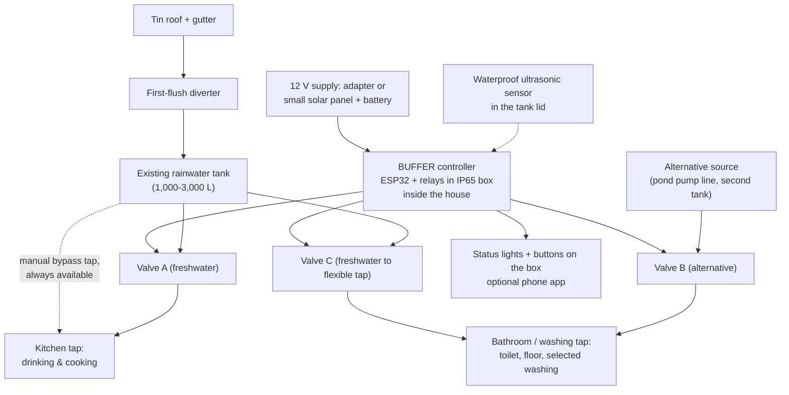

# Household installation (field version)

The bench prototype proves the logic. In a home, BUFFER is a **retrofit on an existing rainwater
system**: it adds a sensor, two valves and a controller box. It needs no new tank and no new water source.

## Layout

In a home, the flexible-use tap can be fed from **either** source, so it needs two valves
(B from the alternative, C from freshwater). The two lines meet only through a check valve at the
tap, so alternative water can never flow back into the freshwater line. The drinking tap is fed only
by freshwater.

## What gets installed

| Part | Field choice | Why it differs from the bench |
|---|---|---|
| Level sensor | Waterproof ultrasonic (JSN-SR04T type) in the tank lid | Tank interior is humid and dark |
| Valves | 12 V normally-closed solenoid valves rated for low-pressure gravity feed, or motorised ball valves | Household flow, low head; ball valves hold position with no power |
| Controller | ESP32 + relay board in an IP65 enclosure indoors | Dust, humidity, insects |
| Power | 12 V adapter, or 10-20 W solar panel + small 12 V battery where grid power is unreliable | Coastal outages |
| Interface | 3 status lights (green NORMAL, amber PRESERVE, red CRITICAL) + use buttons, optional phone dashboard | Works without literacy or internet |
| Flow sensing | One flow sensor on the freshwater outlet | Measures actual use for the allowance |
| Bypass | Manual tap on the freshwater outlet, always usable | BUFFER must never lock a family out of its water (PROJECT.md §46) |

## Installation steps (about half a day, one technician)

1. Confirm with the household and the NGO which uses the alternative source is approved for (PROJECT.md §14).
2. Fit the sensor in the tank lid; measure the tank's cross-section and outlet height.
3. Cut the outlet line; fit valve A to the drinking tap, valve C and valve B to the flexible tap with a check valve.
4. Fit the manual bypass tap and label it.
5. Mount the controller box indoors, above floor level; run low-voltage cable to the valves with drip loops.
6. Enter household size, tank geometry and the protected reserve; set the season's recharge estimate.
7. Walk the family through the three lights, the buttons and the bypass. Leave a printed card in Bangla.

## Rough unit cost (estimate)

| Item | BDT (estimate) |
|---|---|
| ESP32 + relay board + buck converter | 750 |
| Waterproof ultrasonic sensor | 700 |
| Three 12 V valves | 2,700 |
| Flow sensor | 380 |
| IP65 box, cable, fittings, check valve, bypass tap | 1,500 |
| 12 V adapter (or solar kit, add about 3,000-4,000) | 300 |
| **Total, grid-powered** | **about 6,300** |

Prices for the bench parts come from Bangladeshi retailers in October 2026 (see `bom.csv`); field-only
parts are estimates to confirm with suppliers. Volume purchasing through an NGO programme should lower them.
