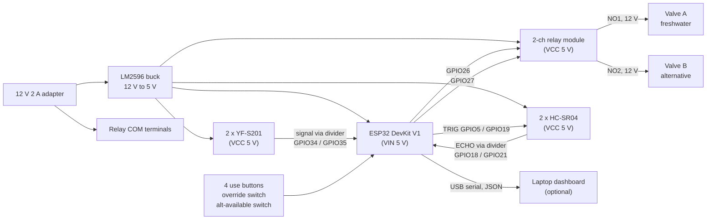

# Wiring: BUFFER bench prototype

Firmware pin map: [`firmware/include/config.h`](../firmware/include/config.h).
Everything runs from one **12 V DC** adapter. No mains voltage is ever near the water.

## Block diagram



## Pin table

| ESP32 pin | Connects to | Notes |
|---|---|---|
| VIN | Buck converter 5 V out | Set the buck to 5.0 V **before** connecting the ESP32 |
| GND | Common ground | Shared by the buck, relay board, sensors and the 12 V negative |
| GPIO5 | HC-SR04 fresh TRIG | 3.3 V trigger is accepted by the HC-SR04 |
| GPIO18 | HC-SR04 fresh ECHO via divider | ECHO is 5 V: 1 kΩ in series, 2 kΩ to GND, tap to GPIO18 |
| GPIO19 | HC-SR04 alternative TRIG | |
| GPIO21 | HC-SR04 alternative ECHO via divider | Same 1 kΩ / 2 kΩ divider |
| GPIO34 | YF-S201 fresh signal via divider | Input-only pin; the sensor board pulls up to 5 V, so divide it |
| GPIO35 | YF-S201 alternative signal via divider | Input-only pin |
| GPIO26 | Relay IN1 (valve A) | Relay module is active-LOW (`RELAY_ACTIVE_LOW 1`) |
| GPIO27 | Relay IN2 (valve B) | |
| GPIO13 / 14 / 32 / 33 | Buttons: drinking & cooking / toilet / floor / washing | Button to GND, internal pull-up |
| GPIO25 | Override toggle switch | Closed = household forces freshwater for every use |
| GPIO23 | Alternative-available toggle switch | Closed = pond or second tank usable |
| GPIO2 | On-board LED | Steady = automatic, blinking = level sensor fault |

## Valve circuit

```
12 V + ──── Relay COM1 ──(contact)── NO1 ──┬── Valve A coil + 
                                           │
                                     1N4007 (stripe to +)
                                           │
12 V − ────────────────────────────────────┴── Valve A coil −
```

Repeat for valve B on COM2 / NO2. The diode across each coil absorbs the voltage spike when the
relay opens, protecting the relay contacts.

## Safety rules for the bench

1. **12 V only.** The adapter stays plugged in at a wall socket away from the bench; only the low-voltage lead reaches the table.
2. **Electronics on the dry side.** ESP32, relay and buck sit on the cutting mat, at least 40 cm from the tanks, higher than the outlet tubing. Wires to the valves leave the mat with a drip loop.
3. **Normally-closed valves.** If power or the controller fails, both valves close. Drinking water is still reachable by hand from the tank outlet.
4. **One valve at a time.** The firmware never opens both valves, so the two water lines can never mix.
5. **Divide every 5 V signal** going into the ESP32 (two ECHO lines, two flow lines). GPIOs are 3.3 V.

## Calibration

1. **Tank geometry:** measure the inside cross-section (cm²), the usable water height above the outlet (cm),
   and the sensor-to-surface distance when full (cm). Enter them in `config.h` (`TANK_AREA_CM2`,
   `TANK_HEIGHT_CM`, `TANK_FULL_GAP_CM`).
2. **Flow sensors:** run exactly 1 L through each line into a measuring jug and read the pulse count from the
   telemetry; set `FLOW_PULSES_PER_LITRE` (datasheet value 450).
3. **Scale:** `HOUSEHOLD_LITRES_PER_RIG_LITRE` maps the bench tank to the household reserve it represents
   (default: 5 L rig = 200 L household).
