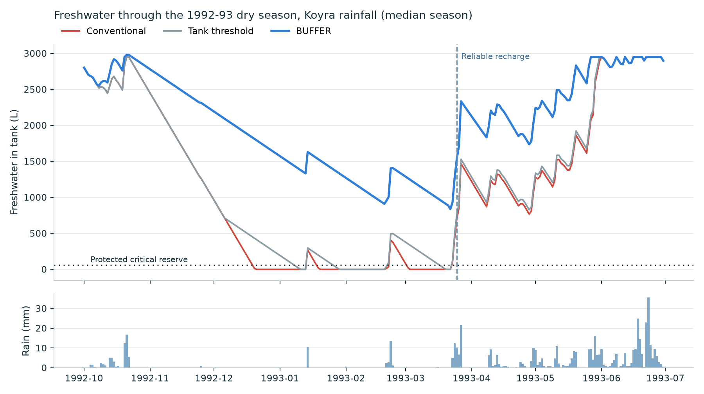
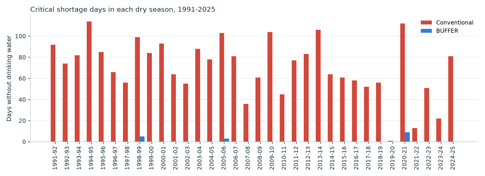
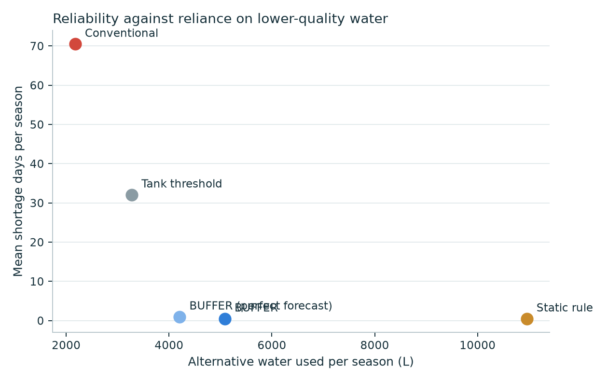
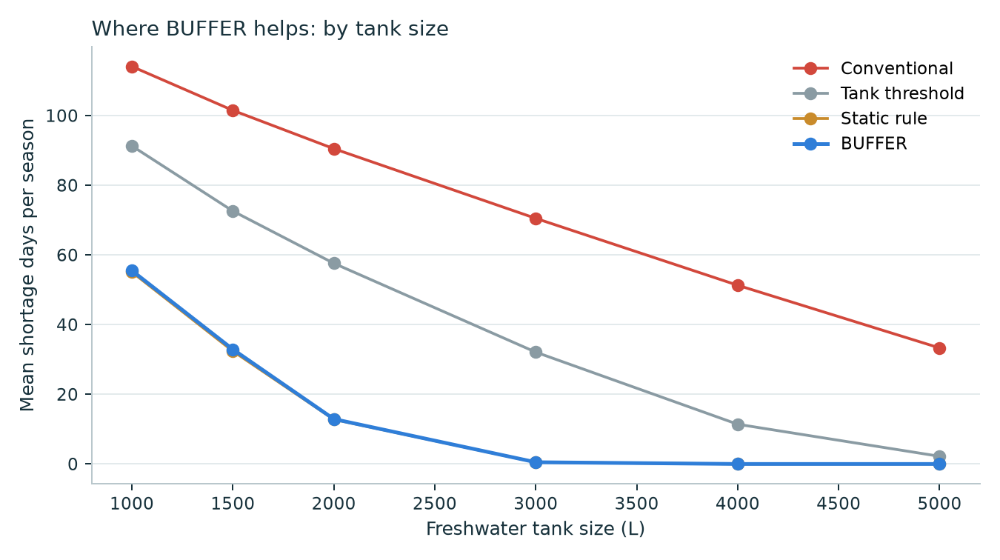

# BUFFER simulation results

All numbers below are **SIMULATED** with real rainfall. Household values are **ASSUMPTIONS** for
scenario testing, not field measurements (PROJECT.md §88). Regenerate everything with:

```
python -m buffer_sim.experiments && python -m buffer_sim.report
```

## Data and method

- **Rainfall (real):** NASA POWER daily PRECTOTCORR, 1991-06-01 to 2025-05-31 (34 dry seasons), at Koyra, Khulna, Bangladesh (22.34 N, 89.3 E).
- **Water balance, daily:** roof inflow (rain minus a 0.5 mm first flush, x 40.0 m² x runoff 0.8) fills a 3,000 L tank; overflow is lost. Drinking and cooking are always served first.
- **Reliable recharge:** a spell with at least 30 mm of rain over three days.
- **BUFFER's forecast:** climatology 75th percentile of days-to-recharge from the other 33 seasons, plus a reliable 3-day weather forecast. Each season is evaluated with a forecast built only from the *other* seasons, so it never sees its own future.
- **Shortage day:** a day on which drinking and cooking (20 L) cannot be fully met from freshwater.

| Household assumption | Value |
|---|---|
| People | 5 |
| Drinking + cooking | 4.0 L per person per day (20 L) |
| Flexible uses normally taken from stored rainwater | 6.0 L per person per day (30 L) |
| Freshwater tank | 3,000 L |
| Roof catchment | 40.0 m², runoff coefficient 0.8 |
| Protected critical reserve | 3 days (60 L) |
| Alternative source | always available (see the dry-pond test below) |

## The five policies

| Policy | Rule |
|---|---|
| Conventional | Every use draws freshwater until the tank is empty |
| Static rule | Flexible uses always go to the alternative source |
| Tank threshold | Flexible uses switch to the alternative once the tank falls below 25% |
| **BUFFER** | Flexible uses may only spend freshwater beyond the protected reserve and the drinking water needed until the forecast recharge (PROJECT.md §42) |
| BUFFER, perfect recharge date | Same rule, but told the true date of the next recharge spell |

## Results over 34 dry seasons (1991-92 to 2024-25)

| Policy | Mean shortage days per season | Seasons with any shortage | Worst season (days) | Alternative water used (L per season) | Freshwater for flexible uses (L per season) |
|---|---|---|---|---|---|
| Conventional | 70.5 | 34 of 34 | 114 | 2,176 | 8,782 |
| Static rule | 0.5 | 3 of 34 | 9 | 10,958 | 0 |
| Tank threshold | 32.1 | 29 of 34 | 86 | 3,277 | 7,681 |
| **BUFFER** | 0.5 | 3 of 34 | 9 | 5,086 | 5,872 |
| BUFFER, perfect recharge date | 1.0 | 4 of 34 | 16 | 4,208 | 6,750 |





## What this shows

1. **The problem is real in this rainfall record.** With conventional use, the household runs out of
   drinking water in **34 of 34** seasons, for **70.5 days** on average.
2. **BUFFER removes almost all of it.** Mean shortage falls to **0.5 days**, and **31 of 34**
   seasons have no shortage at all. That is **70.0 freshwater-days gained per season** and
   **1,367 L** of unmet drinking and cooking water avoided.
3. **BUFFER matches the static rule's reliability while using 54% less alternative water**
   (10,958 L against 5,086 L per season). The static rule protects freshwater by never
   using it for flexible tasks, even in the wet season when the tank overflows. BUFFER only restricts
   use when the forecast says the reserve is at risk, so the household keeps using its best water whenever that is safe.
4. **Planning conservatively beats knowing the date.** BUFFER with the true recharge date does slightly *worse*
   (1.0 days) than BUFFER with the 75th-percentile climatology, because one recharge spell does not
   guarantee steady rain afterwards. A cautious forecast is both deployable and safer.



## Where BUFFER is useful, neutral, and insufficient (PROJECT.md §51)

### Tank size

| Tank | Conventional | Tank threshold | Static rule | BUFFER | Alternative used, static rule (L) | Alternative used, BUFFER (L) |
|---|---|---|---|---|---|---|
| 1,000 L | 114.1 | 91.3 | 55.1 | 55.5 | 10,958 | 5,945 |
| 1,500 L | 101.5 | 72.6 | 32.4 | 32.9 | 10,958 | 5,650 |
| 2,000 L | 90.5 | 57.6 | 12.8 | 12.9 | 10,958 | 5,485 |
| 3,000 L | 70.5 | 32.1 | 0.5 | 0.5 | 10,958 | 5,086 |
| 4,000 L | 51.3 | 11.4 | 0.0 | 0.0 | 10,958 | 4,415 |
| 5,000 L | 33.3 | 2.2 | 0.0 | 0.0 | 10,958 | 3,525 |

- **Useful:** from about 3,000 L upward BUFFER brings shortage to zero or near zero while halving reliance on alternative water.
- **Neutral:** for small tanks BUFFER and the static rule give the same reliability, because neither can afford any flexible freshwater.
- **Insufficient:** at 1,000-2,000 L even drinking and cooking alone outlast the stored water in many seasons.
  BUFFER cannot create water; these households need more storage, and BUFFER's runway number tells them how much.



### When the pond dries up (alternative unavailable March to May)

| Policy | Mean shortage days | Flexible water not served (L per season) |
|---|---|---|
| Conventional | 70.5 | 903 |
| Static rule | 9.0 | 287 |
| Tank threshold | 42.4 | 830 |
| **BUFFER** | 0.5 | 1,075 |
| BUFFER, perfect recharge date | 1.0 | 975 |

When the alternative source fails late in the dry season, the static rule and the threshold rule fall back
to freshwater and run out (static rule: 9.0 days). BUFFER still holds shortage to
0.5 days. The cost is honest: about 1,075 L of flexible use per season goes unserved,
which BUFFER makes visible as a choice instead of a surprise.

### Household size

| People | Conventional | Static rule | BUFFER |
|---|---|---|---|
| 3 | 20.5 | 0.0 | 0.0 |
| 5 | 70.5 | 0.5 | 0.5 |
| 7 | 99.9 | 15.0 | 15.7 |

### Forecast caution

| BUFFER plans for the recharge date exceeded in | Mean shortage days | Seasons with shortage | Alternative used (L) |
|---|---|---|---|
| 50% of past seasons (quantile 0.5) | 0.9 | 3 | 4,450 |
| 25% of past seasons (quantile 0.75) | 0.5 | 3 | 5,086 |
| 9% of past seasons (quantile 0.9) | 0.5 | 3 | 5,442 |

Results barely change across forecast settings: BUFFER does not depend on a precise forecast.

## Uncertainty: 2,000 resampled seasons with noisy demand

Each run draws one of the 34 real seasons at random and varies daily demand
(drinking and cooking about ±15%, flexible use about ±30%).

| Policy | Chance of any shortage in a season | Mean shortage days | 90th-percentile season |
|---|---|---|---|
| Conventional | 99.9% | 72.5 | 107 |
| Static rule | 8.2% | 0.6 | 0 |
| Tank threshold | 85.4% | 33.4 | 59 |
| **BUFFER** | 8.2% | 0.6 | 0 |

## Automatic valves against advice only

In advice-only mode (BUFFER Lite) the household decides whether to follow the routing. Here it follows
the advice on a random share of days and uses freshwater for everything on the others.

| Days the advice is followed | Mean shortage days | Seasons with shortage |
|---|---|---|
| 100% | 0.5 | 3 of 34 |
| 80% | 8.1 | 14 of 34 |
| 60% | 28.1 | 30 of 34 |
| 40% | 45.4 | 31 of 34 |
| 0% | 70.5 | 34 of 34 |

Every missed day spends freshwater the household will need later, so the benefit falls quickly:
following the advice 80% of the time already raises shortage from 0.5 to
8.1 days a season. This is the case for automatic valves in the
BUFFER Control tier, and for advice-only mode as an entry product rather than the end state.

## Sensor failure

With the freshwater level sensor down for all of January every season, BUFFER falls back to protecting
freshwater (no flexible allowance), exactly as the firmware does. Mean shortage stays at
**0.5 days**: a month-long outage in the driest stretch costs nothing.

## Check against published field data

The model is run the way coastal households already behave: stored rainwater is kept for drinking and
cooking only (Ghosh & Ahmed 2022). Household values come from a rainwater system evaluated in rural Khulna:
4 people, 24 L/day drinking and cooking only, 40 m2 roof (literature). The household's tank size is not reported in the field studies,
so the model is shown for the realistic range of household storage.

| Published observation | Value | Where |
|---|---|---|
| Average storage period of rainwater | 4.7 months | Sutarkhali, Dacope (Khulna), 116 households |
| Households that cannot store enough for the whole year | 91% | Sutarkhali, Dacope (Khulna), 116 households |
| Months a year without reliable water, Koyra | 2.84 months | Koyra; survey of 66,234 households in Koyra, Dacope, Paikgachha, Assasuni and Shyamnagar |
| Months a year without reliable water, five-upazila average | 4.65 months | five-upazila average, same survey |
| Households with year-round rainwater access, Koyra | 27% | Koyra |

| Tank | Storage period after the tank was last full (months) | Seasons when rainwater did not last all year | Months without rainwater per year |
|---|---|---|---|
| 500 L | 0.7 | 100% | 3.2 |
| 1,000 L | 1.5 | 97% | 2.27 |
| 1,500 L | 2.3 | 91% | 1.62 |
| 2,000 L | 3.3 | 85% | 1.0 |
| 3,000 L | 5.2 | 24% | 0.13 |

**Reading:** four of the five published figures fall inside what the model produces for household tanks of
500-3,000 L: a 4.7-month storage period sits between the 2,000 L and 3,000 L results; 91% of households running
short matches about 1,500 L; 2.84 months without reliable water in Koyra matches 500-1,000 L; 27% year-round access
falls between 2,000 L and 3,000 L. The fifth does not: the five-upazila average of 4.65 months without reliable water
is worse than even the 500 L result (3.2 months), pulled up by Paikgachha (7.15 months). Possible reasons, not tested
here: households with very small or no rainwater storage, rainwater used beyond drinking and cooking, or larger
families than the 4 people modelled. No single tank size reproduces all figures at once, as expected when real households have a
mix of tank sizes, family sizes and habits that the surveys do not report. This is a
**consistency check, not a calibration**: it shows the water balance behaves like the real places, not that
it predicts any one household. A pilot with measured tanks and use would close this gap.

## Household values from the literature

The main comparison rerun with published values instead of our assumptions: 4 people,
6.0 L/person/day for drinking and cooking, a 2,000 L tank (the tank each family received
in UNDP's Gender-responsive Coastal Adaptation project in Khulna and Satkhira), 40 m² roof, runoff 0.8.
Flexible use stays an assumption (6.0 L/person/day).

| Policy | 2,000 L tank: shortage days | Seasons with shortage | Alternative water (L) | 3,000 L tank: shortage days | Seasons with shortage |
|---|---|---|---|---|---|
| Conventional | 88.1 | 34 of 34 | 2,160 | 67.1 | 33 of 34 |
| Tank threshold | 64.7 | 33 of 34 | 2,897 | 39.6 | 30 of 34 |
| Static rule | 30.5 | 29 of 34 | 8,766 | 4.0 | 8 of 34 |
| **BUFFER** | 30.9 | 29 of 34 | 4,456 | 4.0 | 8 of 34 |

**Reading:** with the published 6 L/person/day for drinking and cooking, a 2,000 L tank cannot carry even drinking
water through most dry seasons; BUFFER cuts shortage from about 88 to 31 days, the same as the best any routing can do,
and the rest is a storage gap. With 3,000 L, BUFFER brings it to 4 days. The honest message for programmes: BUFFER
makes the most of the storage a household has, and its runway display shows where storage itself must grow.

## Other locations

Same household (5 people, 3,000 L), each site's own 34 seasons of NASA POWER rainfall.

| Site | Climate | Annual rain (mm) | Conventional | Tank threshold | Static rule | BUFFER | BUFFER, cautious forecast | Alternative water: static rule / BUFFER (L) |
|---|---|---|---|---|---|---|---|---|
| Koyra, Khulna, Bangladesh | southwest coast | 1,817 | 70.5 | 32.1 | 0.5 | 0.5 | 0.5 | 10,958 / 5,086 |
| Kuakata, Patuakhali, Bangladesh | south-central coast | 2,536 | 65.9 | 30.3 | 0.1 | 0.1 | 0.1 | 10,958 / 4,787 |
| Bhola, Bangladesh | south-central coast | 2,516 | 64.3 | 30.4 | 0.0 | 0.0 | 0.0 | 10,958 / 4,738 |
| Hatiya, Noakhali, Bangladesh | southeast coast | 2,759 | 63.6 | 31.7 | 0.1 | 0.1 | 0.1 | 10,958 / 4,598 |
| Cox's Bazar, Bangladesh | southeast coast | 4,528 | 58.9 | 30.2 | 0.1 | 0.5 | 0.1 | 10,958 / 4,010 |
| Rajshahi, Bangladesh | different climate: drought-prone northwest | 1,264 | 92.1 | 49.9 | 3.8 | 6.6 | 4.5 | 10,958 / 5,959 |
| Chennai, India | different climate: northeast-monsoon coast | 1,280 | 70.0 | 35.3 | 0.3 | 0.8 | 0.3 | 10,958 / 5,289 |

Shortage days per dry season. "Cautious forecast" plans for the recharge date exceeded in only 10% of past seasons
instead of 25%.

**Reading:** across all five Bangladeshi coastal sites BUFFER cuts shortage from 59-71 days to 0-0.5 days and uses about
half the alternative water of the static rule. In the two different climates the standard forecast setting is slightly
less safe than the static rule (Rajshahi 6.6 against 3.8 days; Chennai 0.8 against 0.3); planning more cautiously
closes most of that (Rajshahi 4.5, Chennai 0.3) while still using less alternative water. The forecast caution is a
setting each deployment should choose for its climate.

## Limitations

- The headline household (5 people, 4 L/person/day, 3,000 L) is an assumption; the literature-based household above
  uses published values except for flexible use. Both must be replaced with measured values from a pilot.
- The field check compares against survey averages; the surveys do not report tank-size distributions.
- NASA POWER is a gridded reanalysis product (0.5 degree), not a rain gauge at the house.
- The model assumes the household follows the routing (automatic valves make this realistic; advisory mode would not).
- Water quality is outside the model: the alternative source is assumed pre-qualified for its permitted uses (PROJECT.md §14).
